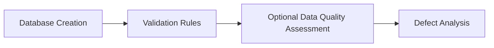

# Sewer Defect Analysis Framework

This organization contains the code and resources supporting multiple research studies on defect-level analysis of sewer systems.

## Papers and Repositories
### 1. Database Structure for Defect-Level Modelling

### 2. Validation Rules and Workflow

### 3. Defect Distribution Analysis
