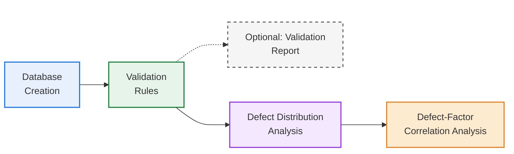

# Sewer Defect Analysis Framework

This repository presents a framework for analyzing defects in sewer pipes. The project is organized into five sequential steps, each designed to support a comprehensive examination of defect characteristics within sewer systems.

Each step is implemented in a separate repository and is described in detail in the associated academic papers. As each component serves a distinct purpose, users may choose to execute individual steps independently or run the full workflow for a complete analysis.

The flow diagram below illustrates the overall process. Each step can be accessed by clicking on its corresponding name.

A brief description of each step is provided below, together with the DOI links to the corresponding papers, where each component is described in greater detail.

## Papers and Repositories
### 1. Database Structure for Defect-Level Modelling

This repository implements the database structure proposed in the study by translating the conceptual Entity–Relationship Diagram (ERD) into an executable relational schema using Python. The aim is to provide a coherent and well-organized representation of all entities, attributes, and relationships required for defect-level sewer condition analysis.

The schema incorporates the recommended factors, defect properties, and failure attributes identified in the literature. While the structure provides a standardized framework with predefined units and recommended fields, it is fully adaptable, allowing users to modify attributes, extend the schema, or adjust data types according to specific project requirements.

The DOI for the repository is:

### 2. Validation Rules and Validation Report

This repository implements a set of validation rules designed to ensure that the data are consistent and suitable for subsequent analysis. The validation process is applied to each pipe-related dataset, including pipe attributes, inspection records, and defect data. It includes checks such as identifying duplicate records, handling missing or null values, and verifying that the data comply with expected formats and value ranges.

The application of validation rules is strongly recommended prior to analysis to improve data reliability and consistency.

In addition, an optional validation report can be generated in Excel format, summarizing the fields that do not comply with the expected data types or fall outside the defined ranges. This report provides a systematic record of data inconsistencies, supporting transparency and enabling users to review potential issues without modifying the original dataset.

### 3. Defect Distribution Analysis
This repository uses the validated data to perform a descriptive analysis of defects and their properties. The analysis aims to characterize the observed defects and provide insight into their distribution within the network.

Specifically, the code enables the description of the sewer network and its comparison with the subset of pipes inspected via CCTV, allowing an assessment of the representativeness of the inspection data. In addition, it supports the analysis and visualization of key defect properties observed during inspections, including the average number of defects per pipe, defect type, defect size, longitudinal location along the pipe, extent, and circumferential position.

### 4. Defect–Factor Correlation Analysis
This repository analyzes CCTV inspection data and reported sewer defects to explore the relationships between pipe-related factors (both numerical and categorical) and different defect types. The analysis can be performed for different pipe materials, allowing users to identify patterns, similarities, and differences in how factors relate to defect occurrence.

The code supports the evaluation of statistical associations between factors and defects, enabling the identification of variables that may influence the presence or frequency of specific defect types.
